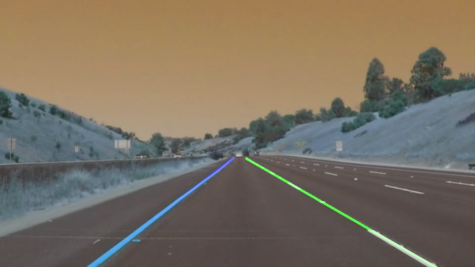

# **Finding Lane Lines on the Road** 

---

**Finding Lane Lines on the Road**

The goals / steps of this project are the following:
* Make a pipeline that finds lane lines on the road
* Tune the parameters for image processing to perform lane detection on given set of reference videos

Reference code was provided that implements the necessary computer vision functions for the lane detection as covered in **Lesson 1: Computer Vision Fundamentals**

---

### Reflection

### 1. Setting up the pipeline for lane detection

My pipeline consisted of following steps:

1. First, I converted the image to gray scale
2. Then I applied Gaussian smoothing on the gray scale image. I chose a kernel size of 3
3. Then I applied Canny edge detection. A threshold range of (50, 150) worked well on the given test images
4. Then I performed masking to obtain edges only part of the region that corresponds to the ego lane. I adjusted the mask region based on the image dimension (540 * 960). I chose the boundaries to be (30, 540), (450, 320), (500,320) and (960, 540). This boundary seemed to eliminate edges detected from image area where ego lane will not exist
5. Then I applied Hough transform. I chose rho to be 2, theta to be 1, threshold as 25, minimum line length as 40 and maximum line gap as 20. This seemed to provide a stable line detection across the first two videos.
6. The next step was to split the lines into left and right lanes and extrapolate the detected lines into single straight line. I splite the detected ilnes based on positive and negative slopes into right and left lanes. Then I performed a first order polynomial fit to obtain a single straight line for each lane out of detected lines.

This implementation worked well on the test images. One such output is shown below:

The output of all test images are available here:
[Image output](./test_images_output)

The output videos are available here:
[Video output](./test_videos_output)
---

### 2. Modifications done for the challenge video
When running the pipeline on the challege video, several errors occur. I made following modifications to improve the performance.

1. First, I figured out that the video has a different resolution (720 * 1280). So, I adapted the mask boundaries for this video accordingly.
2. Then, I observed that the camera captured part of reflections from the hood of the car. This resulted in edge detection on the lower boundary of the image. Also, the median in the highway was resulted in edges on the left part of image. So, I narrowed the mask region on bottom, left and right of image. I set the mask boundary to (120, 630), (550,460), (750,460), (1160,630). This greatly improved the detected edges.
3. Also, the road had lots of patches and there were edges detected when the patch road appeared. So, I added a filter to discard lines that had low gradients. I also added a logic to store previous lanes and render them when the parameters failed to detect lanes on certain frames.
4. There were still many false line detection due to the set parameters in edge detection, for e.g .tail lamps of vehicles in challenge video are detected as edges.

With this setting I got a reasonably good output for the challenge video, but there were still few frames where the lane detection was erroneous.

### 3. Potential shortcomings with this pipeline

* The lane detection is tailor made for straight lines. On curved roads, there should be a better extrapolation method.
* Parameters set for Hough transform does not work with good efficiency on both continuous and broken lanes. I could notice few frames where the broken lanes were not detected at all.
* The algorithm does not account for other objects e.g vehicles that appear on the image. Some filtering of these objects is required.

### 4. Possible improvements to pipeline

The following improvements are possible:
* Better parameter tuning for the Hough Transform and Canny edge detection that suits well for different brightness level in the image
  The current parameters are not stable across all test videos. There were several false edges.
* There should be better smoothing or filter algorithm to eliminate edges that are not relevant relative to previous frames
* I did not use any color based filtering. That could be reduce false edge detection

